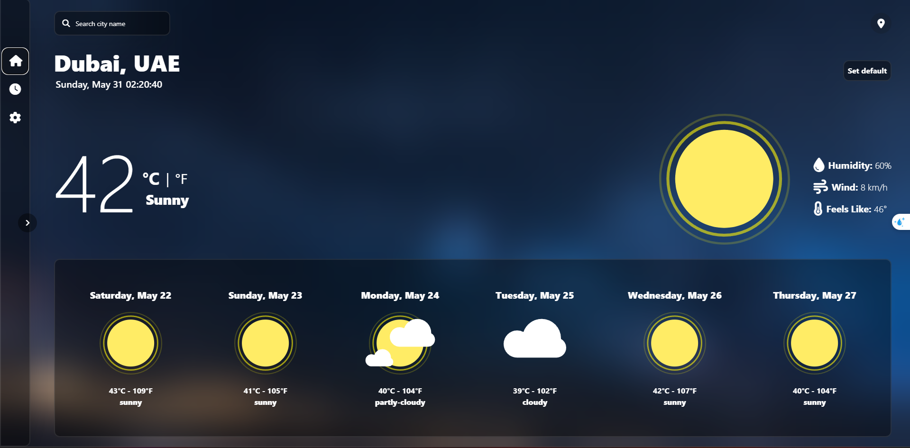
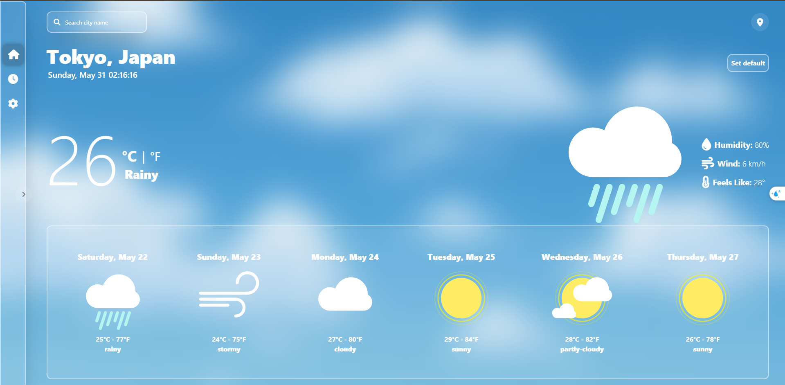
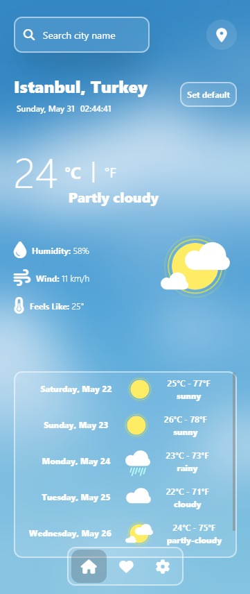

# Weather Dashboard

A modern and responsive weather dashboard built with JavaScript and Tailwind CSS.

This project simulates a weather application using local JavaScript data while focusing on frontend development concepts such as responsive design, theme switching, dynamic UI updates, and browser storage.
---

## Features

* Search cities by name
* Multi-day weather forecast
* Dark / Light theme
* Temperature unit conversion (°C / °F)
* Save default city
* Local Storage persistence
* Responsive design
* Mobile-friendly navigation
* Glassmorphism-inspired UI

---

## Screenshots

### Desktop - Dark Mode

### Desktop - Light Mode

### Mobile View

---

## Technologies Used

---

## Project Features

### City Search

Users can search and switch between different cities.

### Theme Switching

Supports both Dark and Light themes with persistent settings.

### Temperature Conversion

Switch between Celsius and Fahrenheit units.

### Local Storage

Stores user preferences such as:

* Theme mode
* Default city

### Responsive Design

Optimized for desktop, tablet, and mobile devices.

---

## What I Learned

- DOM Manipulation
- Event Handling
- Local Storage
- Theme Switching
- Responsive Design
- Search and Filtering
- Dynamic UI Updates
- Working with JavaScript Arrays

---

## Future Improvements

* Real Weather API Integration
* Hourly Forecast
* Favorite Cities
* Multiple Language Support
* Progressive Web App (PWA)
